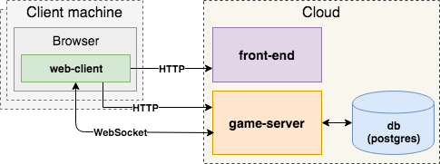

@title[Credits]
<!-- .slide: class="center" -->
Credits:
- Backend — Vitaly Makeev
- Frontend — Artur Zamaliutdinov
- Web — Maxim Krasilnikov

---
@title[Architecture overview]
<!-- .slide: class="center" -->
### Architecture overview

---
@title[Architecture overview]
<!-- .slide: class="center" -->

---
@title[Game Server]
Game Server is a separate application that do in cycle:
0. gets input from multiple clients
0. play game mechanics
0. send game state to clients (replica)

---
@title[Features]
### Features:
- Matches for 1, 2 and 4 people 
- List of current players on the right
- Login screen
- Background music and sounds
- Smooth corner collision
- 4 types of bonuses
- Victory and lose animations

---
@title[Delpoyment]
<!-- .slide: class="center" -->
Both servers were deployed in google cloud services
http://35.228.192.148:8080

---
@title[Git]
### GitHub Repository
https://github.com/mirmashel/bomberman/

---
@title[Thank you for your attention]
Thank you for your attention!

